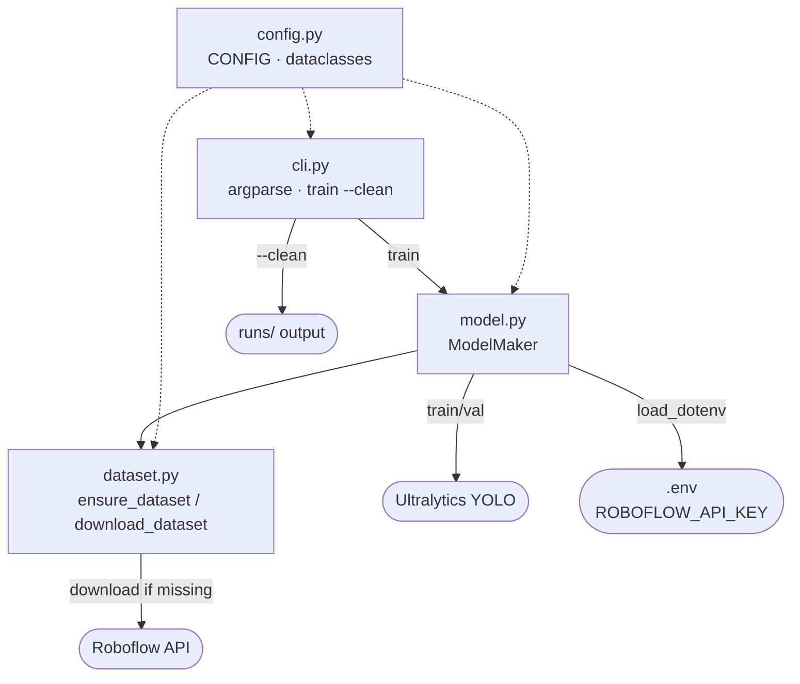

# Board Recognition

Train a YOLO classifier on electronic-component images.

## REQUIREMENTS
* Python>=3.14
* uv package manager>=0.11.16
* CMake>=4.0.0

## USAGE
```bash
uv sync
uv run board-recognition train --clean
```

## ARCHITECTURE



### Module roles
| Module | Role |
|--------|------|
| `config.py` | Central paths + Roboflow/Train params (frozen dataclasses, `CONFIG`) |
| `dataset.py` | Download from Roboflow; skip if dataset already present |
| `model.py` | `ModelMaker` — ensure dataset, train, validate |
| `cli.py` | Entry point `board-recognition train [--clean]` |
